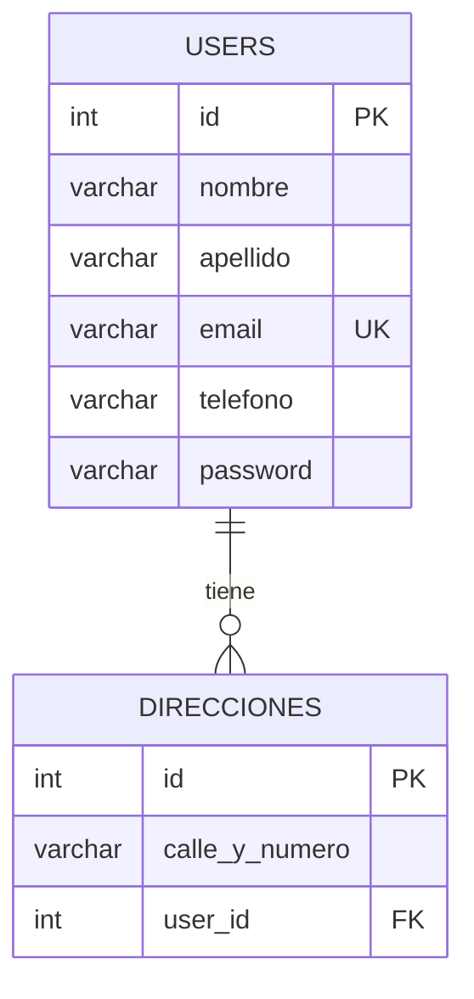
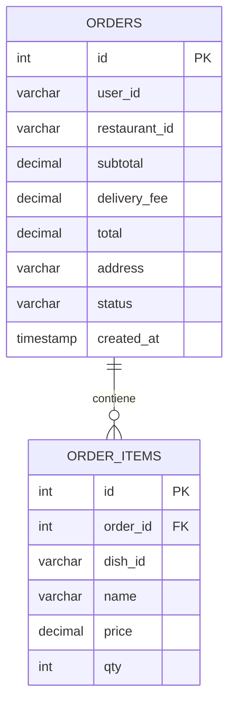
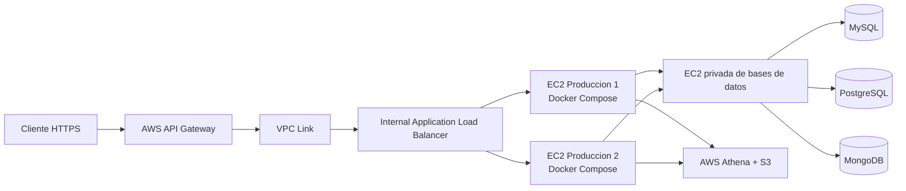

# CloudEats en AWS Academy

Guia para ejecutar los cinco microservicios del proyecto en AWS Academy usando instancias EC2, Docker y bases de datos separadas.

## Microservicios

| Servicio | Carpeta | Puerto actual | Tecnologia | Dependencia |
|---|---|---:|---|---|
| Usuarios | `ms-usuarios` | `8000` | FastAPI, MySQL | MySQL |
| Pedidos | `ms-pedidos` | `8000` | Express, PostgreSQL | PostgreSQL y Catalogo |
| Catalogo | `ms-catalogo` | `3002` | Go, MongoDB | MongoDB |
| Historial | `ms-historial` | `3004` | Go, net/http | Usuarios, Catalogo y Pedidos |
| Consultas | `ms-consultas` | `3005` | FastAPI, boto3, Athena | Athena y S3 |

`ms-usuarios` y `ms-pedidos` usan el mismo puerto interno (`8000`). Para no consumir demasiados recursos del laboratorio, la topologia recomendada es una EC2 de aplicaciones con los cinco contenedores y una EC2 de bases de datos. Se publica Usuarios en el puerto externo `8001` y Pedidos en `8000`; ambos conservan su puerto interno `8000`.

Para probar la integracion completa en local existe [docker-compose.local.yml](docker-compose.local.yml). Levanta las tres bases de datos y los cinco microservicios en una red privada de Docker.

## 1. Requisitos de AWS Academy

En AWS Academy, inicia el laboratorio y usa las credenciales temporales de **AWS Details**. Crea los recursos mientras la sesion este activa, porque las credenciales y algunas instancias pueden dejar de estar disponibles al finalizar el laboratorio.

Necesitas:

- Una VPC con subredes y acceso a Internet.
- Una instancia EC2 Ubuntu 22.04 para los cinco microservicios.
- Una instancia EC2 para PostgreSQL, MySQL y MongoDB, o servicios equivalentes disponibles en tu cuenta.
- Un bucket S3 y una base de datos/catalogo de Athena para `ms-consultas`.
- Un Security Group. Abre SSH (`22`) solo para tu IP y los puertos de API unicamente desde tu IP o desde los Security Groups que necesiten consumirlos.

### Puertos sugeridos

| Recurso | Puerto | Acceso recomendado |
|---|---:|---|
| Usuarios | `8001` externo / `8000` interno | Cliente y Historial |
| Pedidos | `8000` | Cliente y Historial |
| Catalogo | `3002` | Cliente, Pedidos y Historial |
| Historial | `3004` | Cliente |
| Consultas | `3005` | Cliente |
| PostgreSQL | `8004` externo / `5432` interno | Solo Pedidos |
| MySQL | `3306` | Solo Usuarios |
| MongoDB | `27017` | Solo Catalogo |
| SSH | `22` | Tu IP publica |

No expongas bases de datos a `0.0.0.0/0`. En AWS, usa las reglas del Security Group para permitir el trafico entre instancias.

## Endpoints de los microservicios

La siguiente lista corresponde a las rutas implementadas actualmente en el codigo. Reemplaza `<HOST>` por `localhost`, la IP publica o la IP privada segun el origen de la peticion.

### Usuarios (`ms-usuarios`)

Base URL: `http://<HOST>:8000` (o el puerto externo configurado, por ejemplo `8001`).

| Metodo | Endpoint | Descripcion |
|---|---|---|
| `GET` | `/` | Verifica que el servicio este activo. |
| `POST` | `/register` | Registra un usuario y su direccion. |
| `POST` | `/login` | Autentica al usuario y devuelve un token JWT. |
| `GET` | `/usuarios` | Lista los usuarios. |
| `GET` | `/usuarios/{user_id}` | Obtiene un usuario por ID. |
| `GET` | `/docs` | Swagger UI generado por FastAPI. |
| `GET` | `/openapi.json` | Especificacion OpenAPI del servicio. |

### Pedidos (`ms-pedidos`)

Base URL: `http://<HOST>:8000`.

| Metodo | Endpoint | Descripcion |
|---|---|---|
| `GET` | `/` | Verifica que el servicio este activo. |
| `GET` | `/orders` | Lista los ultimos 100 pedidos. |
| `POST` | `/orders` | Crea un pedido. |
| `GET` | `/orders/{id}` | Obtiene un pedido y sus items. |
| `PUT` | `/orders/{id}` | Actualiza el estado; requiere rol `restaurante` o `admin`. |
| `DELETE` | `/orders/{id}` | Elimina un pedido; requiere rol `admin`. |
| `GET` | `/orders/user/{userId}` | Lista los pedidos de un usuario. |
| `GET` | `/orders/restaurant/{restaurantId}` | Lista pedidos; requiere rol `restaurante` o `admin`. |
| `GET` | `/docs` | Swagger UI. |
| `GET` | `/openapi.json` | Especificacion OpenAPI. |

### Catalogo (`ms-catalogo`)

Base URL: `http://<HOST>:3002`.

| Metodo | Endpoint | Descripcion |
|---|---|---|
| `GET` | `/health` | Verifica que el servicio este activo. |
| `GET` | `/api/restaurantes` | Lista los restaurantes. |
| `POST` | `/api/restaurantes` | Crea un restaurante con sus platos y resenas. |
| `GET` | `/api/restaurantes/platos/{dishId}` | Obtiene los datos de un plato por ID. |
| `GET` | `/api/restaurantes/favorito/{userId}` | Obtiene el restaurante asociado a un usuario. |
| `GET` | `/docs` | Swagger UI. |

### Historial (`ms-historial`)

Base URL: `http://<HOST>:3004`.

| Metodo | Endpoint | Descripcion |
|---|---|---|
| `GET` | `/health` | Verifica que el servicio este activo. |
| `GET` | `/api/dashboard?userId={userId}` | Agrega datos del usuario, restaurante favorito e historial de pedidos. |
| `GET` | `/docs` | Interfaz Swagger UI. |
| `GET` | `/openapi.json` | Especificacion OpenAPI del servicio. |

### Consultas (`ms-consultas`)

Base URL: `http://<HOST>:3005`.

| Metodo | Endpoint | Descripcion |
|---|---|---|
| `GET` | `/health` | Verifica que el servicio este activo. |
| `GET` | `/api/analitica/platos-populares?limit={limit}` | Reporte de platos populares, con `limit` entre 1 y 50. |
| `GET` | `/api/analitica/ventas-mensuales` | Reporte consolidado de ventas por mes. |
| `GET` | `/docs` | Swagger UI generado por FastAPI. |
| `GET` | `/openapi.json` | Especificacion OpenAPI generada por FastAPI. |

Las rutas que consume `ms-historial` ya estan implementadas como aliases compatibles en Usuarios, Catalogo y Pedidos.

## Prueba local de integración

Requisitos: Docker Desktop iniciado y Docker Compose disponible.

```bash
docker compose -f docker-compose.local.yml up -d --build
docker compose -f docker-compose.local.yml ps
```

Ejecuta los seeds una sola vez:

```bash
docker compose -f docker-compose.local.yml run --rm usuarios python scripts/seed.py
docker compose -f docker-compose.local.yml run --rm catalogo ./catalog-seed
docker compose -f docker-compose.local.yml run --rm pedidos node seed.js
```

Prueba salud, Swagger y el agregador:

```bash
  curl http://localhost:8001/health
curl http://localhost:3002/health
  curl http://localhost:8000/
curl http://localhost:3004/health
curl http://localhost:3005/health
  curl http://localhost:8001/docs
curl http://localhost:3002/docs
  curl http://localhost:8000/docs
curl http://localhost:3004/docs
curl http://localhost:3005/docs
curl "http://localhost:3004/api/dashboard?userId=1"
```

Para detener la prueba conservando los datos:

```bash
docker compose -f docker-compose.local.yml down
```

Para borrar tambien las bases locales:

```bash
docker compose -f docker-compose.local.yml down -v
```

## Modelo de datos

### MySQL: Usuarios



### PostgreSQL: Pedidos



### MongoDB: Catalogo

La coleccion `restaurants` tiene esta estructura JSON:

```json
{
  "_id": "ObjectId",
  "nombre": "Restaurante Seed 00001",
  "distrito": "Miraflores",
  "platos": [
    {
      "_id": "ObjectId",
      "nombre": "Ceviche",
      "precio": 35,
      "descripcion": "Plato de prueba"
    }
  ],
  "reseñas": [
    {
      "usuarioId": "seed-user-00001",
      "comentario": "Resena de prueba",
      "calificacion": 5
    }
  ]
}
```

## Arquitectura AWS objetivo



El balanceador debe ser interno, las bases de datos deben aceptar trafico solo desde el Security Group de las VMs de produccion y API Gateway debe ser el unico punto publico HTTPS.

## 2. Preparar las instancias EC2

Conectate por SSH a cada instancia y ejecuta:

```bash
sudo apt update
sudo apt install -y ca-certificates curl git
curl -fsSL https://get.docker.com | sudo sh
sudo usermod -aG docker $USER
exit
```

Vuelve a conectarte para que se aplique el grupo `docker`:

```bash
docker --version
git --version
```

Clona el proyecto en la instancia de aplicaciones:

```bash
git clone <URL_DEL_REPOSITORIO>
cd Proy-Cloud
```

Si el repositorio tiene otro nombre, entra en la carpeta que contiene `ms-catalogo`, `ms-consultas`, `ms-historial`, `ms-pedidos` y `ms-usuarios`.

## 3. Preparar las bases de datos

### PostgreSQL para Pedidos

En la instancia de PostgreSQL, crea una red y levanta la base incluida en el proyecto:

```bash
cd Proy-Cloud/ms-pedidos/infra-db
docker network create red_bd
docker volume create pg_orders_data
docker compose up -d
```

El contenedor escucha internamente en `5432` y se publica en `8004` segun el compose actual. Para la aplicacion, usa el puerto que realmente este accesible desde la instancia de Pedidos. Comprueba el servicio con:

```bash
docker ps
docker logs pg_orders_c
```

Ejecuta el esquema de [ms-pedidos/db.txt](ms-pedidos/db.txt) conectandote a PostgreSQL. Por ejemplo, si `psql` esta instalado en la instancia:

```bash
psql "postgresql://root:utec@<IP_PRIVADA_POSTGRES>:8004/bd_api_orders" -f ../db.txt
```

El usuario, contrasena y puertos deben coincidir con las variables usadas por `ms-pedidos`.

### MySQL para Usuarios

Instala MySQL en la instancia de bases de datos o usa un servicio MySQL disponible en tu entorno. Crea la base `mydb` y configura `DATABASE_URL` con el formato:

```text
mysql+pymysql://<usuario>:<contrasena>@<IP_PRIVADA_MYSQL>:3306/mydb
```

`ms-usuarios` crea sus tablas al importar la aplicacion. Cambia la contrasena de ejemplo y no la dejes escrita en el codigo.

### MongoDB para Catalogo

Usa MongoDB en la instancia de bases de datos o MongoDB Atlas. La URI debe tener este formato:

```text
mongodb://<usuario>:<contrasena>@<HOST>:27017/cloudeats_catalogo?authSource=admin
```

El servicio usa `MONGO_URI` y escucha en el puerto `3002`.

## 4. Ajustes necesarios antes de desplegar

El proyecto actual no incluye un `docker-compose.yml` raiz que levante los cinco servicios. Despliegalos individualmente con los comandos de la siguiente seccion.

Tambien hay contratos que deben revisarse antes de una integracion completa:

1. `ms-pedidos` ya usa `/api/restaurantes/platos/:dishId` y los campos `nombre` y `precio` de `ms-catalogo`.
2. `ms-historial` usa rutas `/api/usuarios/...` y `/api/pedidos/...`; revisa que esas rutas existan en las versiones actuales de Usuarios y Pedidos.
3. El endpoint de Usuarios actual usa `/usuarios/:id`, mientras Historial tiene por defecto `/api/usuarios/:id`.
4. `ms-consultas` devuelve datos de respaldo si Athena falla. Verifica que el bucket S3, la base de Athena, las tablas y los permisos IAM existan antes de considerar el servicio operativo.

No uses datos mock como mecanismo de produccion. Son utiles para desarrollo, pero pueden ocultar fallos de conectividad o contratos entre microservicios.

## 5. Desplegar los microservicios

### Usuarios

En la instancia de Usuarios:

```bash
cd Proy-Cloud/ms-usuarios
docker build -t ms-usuarios .
docker run -d --name ms-usuarios --restart unless-stopped \
  -p 8001:8000 \
  -e DATABASE_URL='mysql+pymysql://<usuario>:<contrasena>@<IP_PRIVADA_MYSQL>:3306/mydb' \
  ms-usuarios
```

Comprueba:

```bash
curl http://localhost:8000/
```

### Catalogo

En la instancia del Catalogo:

```bash
cd Proy-Cloud/ms-catalogo
docker build -t ms-catalogo .
docker run -d --name ms-catalogo --restart unless-stopped \
  -p 3002:3002 \
  -e MONGO_URI='mongodb://<usuario>:<contrasena>@<HOST>:27017/cloudeats_catalogo?authSource=admin' \
  ms-catalogo
```

Comprueba:

```bash
curl http://localhost:3002/health
curl http://localhost:3002/api/restaurantes
```

Para cargar datos iniciales, ejecuta desde la carpeta del servicio:

```bash
docker exec ms-catalogo node src/scripts/seed.js
```

### Pedidos

En la instancia de Pedidos, define la IP privada de PostgreSQL y la URL privada del Catalogo:

```bash
cd Proy-Cloud/ms-pedidos
docker build -t ms-pedidos .
docker run -d --name ms-pedidos --restart unless-stopped \
  -p 8000:8000 \
  -e DB_HOST='<IP_PRIVADA_POSTGRES>' \
  -e DB_PORT='8004' \
  -e DB_USER='root' \
  -e DB_PASSWORD='utec' \
  -e DB_NAME='bd_api_orders' \
  -e RESTAURANTS_URL='http://<IP_PRIVADA_CATALOGO>:3002' \
  ms-pedidos
```

El valor de `DB_PORT` debe ser `5432` si la instancia de Pedidos llega directamente al puerto interno de PostgreSQL. Usa `8004` solo si ese es el puerto que permitiste en el Security Group y que realmente publica el contenedor.

Comprueba:

```bash
curl http://localhost:8000/
curl http://localhost:8000/orders
```

### Historial

En la instancia de Historial, configura las URLs privadas de los servicios que consume:

```bash
cd Proy-Cloud/ms-historial
docker build -t ms-historial .
docker run -d --name ms-historial --restart unless-stopped \
  -p 3004:3004 \
  -e MS1_USUARIOS_URL='http://<IP_PRIVADA_APLICACIONES>:8001' \
  -e MS2_CATALOGO_URL='http://<IP_PRIVADA_APLICACIONES>:3002' \
  -e MS3_PEDIDOS_URL='http://<IP_PRIVADA_APLICACIONES>:8000' \
  ms-historial
```

Comprueba:

```bash
curl http://localhost:3004/health
```

### Consultas

En la instancia de Consultas, configura las credenciales temporales de AWS Academy y los recursos de Athena:

```bash
cd Proy-Cloud/ms-consultas
docker build -t ms-consultas .
docker run -d --name ms-consultas --restart unless-stopped \
  -p 3005:3005 \
  -e AWS_REGION='us-east-1' \
  -e AWS_ACCESS_KEY_ID='<ACCESS_KEY_ID_TEMPORAL>' \
  -e AWS_SECRET_ACCESS_KEY='<SECRET_ACCESS_KEY_TEMPORAL>' \
  -e AWS_SESSION_TOKEN='<SESSION_TOKEN_TEMPORAL>' \
  -e ATHENA_S3_OUTPUT='s3://<BUCKET_RESULTADOS>/' \
  -e ATHENA_DATABASE='<BASE_ATHENA>' \
  ms-consultas
```

Comprueba:

```bash
curl http://localhost:3005/health
curl 'http://localhost:3005/api/analitica/platos-populares?limit=10'
curl http://localhost:3005/api/analitica/ventas-mensuales
```

No subas las credenciales temporales a Git ni las escribas en el Dockerfile. Cuando AWS Academy renueve la sesion, actualiza el contenedor con las credenciales vigentes.

## 6. Prueba funcional minima

Ejecuta estas pruebas desde una maquina que pueda acceder a los puertos de las instancias:

```bash
curl http://<IP_PUBLICA_APLICACIONES>:8001/
curl http://<IP_PUBLICA_CATALOGO>:3002/health
curl http://<IP_PUBLICA_APLICACIONES>:8000/
curl http://<IP_PUBLICA_HISTORIAL>:3004/health
curl http://<IP_PUBLICA_CONSULTAS>:3005/health
```

Registra un usuario:

```bash
curl -X POST http://<IP_PUBLICA_APLICACIONES>:8001/register \
  -H 'Content-Type: application/json' \
  -d '{"nombre":"Ana","apellido":"Perez","email":"ana@example.com","telefono":"999999999","password":"cambia-esta-clave","direccion":"Av. Principal 123"}'
```

Inicia sesion:

```bash
curl -X POST http://<IP_PUBLICA_APLICACIONES>:8001/login \
  -H 'Content-Type: application/json' \
  -d '{"email":"ana@example.com","password":"cambia-esta-clave"}'
```

Consulta restaurantes y platos desde Catalogo antes de crear pedidos. El `dish_id` usado en el pedido debe existir y el contrato de rutas/campos debe estar alineado entre Catalogo y Pedidos.

## 7. Operacion y diagnostico

Ver contenedores:

```bash
docker ps
docker ps -a
```

Ver logs:

```bash
docker logs -f ms-usuarios
docker logs -f ms-catalogo
docker logs -f ms-pedidos
docker logs -f ms-historial
docker logs -f ms-consultas
```

Recrear un servicio tras cambiar variables:

```bash
docker rm -f <nombre-contenedor>
docker run ...
```

Verificar conectividad desde una instancia:

```bash
nc -vz <IP_PRIVADA> <PUERTO>
```

Si hay errores de conexion, revisa primero: estado del laboratorio, IP privada actual, reglas del Security Group, puerto publicado por Docker, variable de entorno y logs del contenedor.

## 8. Detener y limpiar

Para detener un servicio sin borrar su imagen:

```bash
docker stop <nombre-contenedor>
```

Para eliminar el contenedor:

```bash
docker rm -f <nombre-contenedor>
```

No elimines los volumenes de PostgreSQL o MongoDB si necesitas conservar los datos. En AWS Academy, detén o termina las instancias cuando termines para no consumir el limite de recursos del laboratorio.